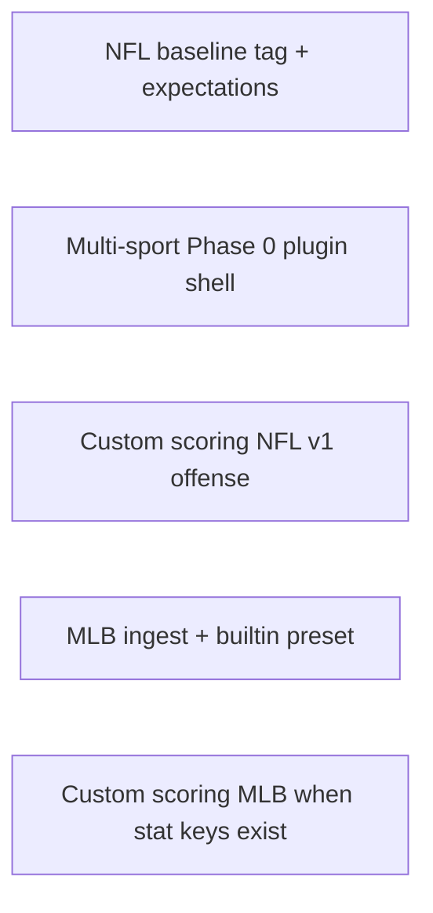

# Custom Scoring (Planned)

Plan for letting users define **custom fantasy scoring** on top of the **stats and player pool we already ingest**. This is an expansion of today’s three built-in offensive presets (Standard / Half-PPR / Full PPR) and fixed ESPN K/DST rules—not a new data source or league importer.

**Status:** Planned (return after NFL baseline + [multi-sport Phase 0](MULTISPORT_ROADMAP.md) is recommended).

**Related:** [ENHANCEMENT_ROADMAP.md](ENHANCEMENT_ROADMAP.md) (NFL polish), [MULTISPORT_ROADMAP.md](MULTISPORT_ROADMAP.md) (sport-scoped plugins).

---

## Goals

- Save **named scoring presets** (e.g. “0.5 PPR + -1 INT”, “Yards-only tweak”).
- Apply them across **Season Leaders**, **Player Profile**, and **Compare** for all ingested seasons **without re-ingest**.
- Use only **columns already in** `weekly_stats` / `season_stats` (QB/RB/WR/TE offensive stats; existing kicker buckets; existing D/ST stats).
- Keep **built-in presets** fast (precomputed columns at ingest stay as-is).

## Non-goals (explicit)

- Importing league settings from ESPN, Yahoo, Sleeper, etc.
- New nflverse stats (IDP, snap counts, 2-pt conversions, bonuses we don’t store).
- Playoff weeks or live in-season sync.
- Beat-draft-rank / ECR matching custom points (ECR stays expert consensus; UI captions only).

---

## What we have today

| Piece | Location | Notes |
|-------|----------|--------|
| Offense presets | `src/scoring/presets.yaml` | Linear weights on shared stat keys |
| Precomputed FP | `fantasy_points_standard`, `_half_ppr`, `_full_ppr` | Written at ingest |
| K / D/ST | `kicker_presets.yaml`, `dst_presets.yaml` | ESPN default; separate columns |
| Query wiring | `fantasy_points_sql_expr()` in `src/scoring/calc.py` | Used everywhere in `queries.py` |
| Sidebar | `DISPLAY_PRESETS` in `calc.py` | Three fixed labels |

Custom scoring should extend **`fantasy_points_sql_expr` / `resolve_preset`**, not fork Leaders/Profile/Compare SQL.

---

## Recommended approach

### Compute at query time (not re-ingest)

When the user selects a **custom** preset, build FP from raw stats in SQL (or pandas for exports):

```text
FP = Σ (stat_column × weight)   -- offense
```

Built-in presets continue to read precomputed columns for speed.

### Preset storage (v1)

| Option | Pros | Cons |
|--------|------|------|
| **DuckDB `scoring_presets` table** | Survives restarts; easy list/delete | Slightly more schema |
| **`data/presets/*.json`** | Simple gitignore per user | Manual backup |

**Recommendation:** DuckDB table with JSON rules blob; optional export/import JSON file in UI.

### Preset shape (v1 — offense)

Mirror `presets.yaml` keys (only stats we ingest):

```yaml
name: My Half-PPR
offense:
  passing_yards: 0.04
  passing_tds: 4
  interceptions: -2
  rushing_yards: 0.1
  rushing_tds: 6
  receiving_yards: 0.1
  receiving_tds: 6
  receptions: 0.5
  fumbles_lost: -2
```

Validation: allowlist stat names from `src/scoring/calc.py` / `STAT_COLUMNS`; reject unknown keys.

### K / D/ST (later phases)

| Phase | Scope |
|-------|--------|
| **v1** | Custom **offense** only; K/DST stay ESPN with existing caption |
| **v2** | Custom **kicker** distance buckets (same fields as `kicker_presets.yaml`) |
| **v3** | Custom **D/ST** including points-allowed tiers (reuse `special.py` logic) |

---

## UI (sketch)

1. **Sidebar:** Scoring dropdown = Standard | Half-PPR | Full PPR | **Custom…** (lists saved presets).
2. **Manage presets** (page or sidebar expander):
   - Clone from built-in → edit weights → Save name
   - Delete preset
   - Import / export JSON (optional v1.1)
3. **Captions:** “Offense uses preset **My Half-PPR**; K/DST use ESPN default.”

No league URL, no OAuth.

---

## Code touchpoints

| Area | Change |
|------|--------|
| `src/scoring/` | `ScoringPreset` type, `validate_preset()`, `fp_sql_expr(preset_id)` → column or dynamic SQL |
| `src/scoring/calc.py` | Unify builtin + custom resolution |
| `src/db/schema.sql` | `scoring_presets(id, name, sport, rules_json, created_at)` |
| `src/db/queries.py` | No signature change if `fantasy_points_sql_expr` stays the single entry |
| `scripts/` | Optional `scripts/list_presets.py`; no ingest change for v1 |
| `app/components.py` | Sidebar preset list + session active preset |
| `app/pages/*` | Captions only if preset-aware already |
| `src/analytics/best_week.py` | Extend `overlay_preset_best_week` for custom |
| `src/analytics/surprise.py` | Caption when custom ≠ ECR semantics |
| **Tests** | Golden player-week rows; SQL expr snapshot tests |

---

## Multi-sport ordering



- **Do Phase 0 first** so presets are `(sport, preset_id)` from day one.
- **Custom NFL offense v1** immediately after Phase 0 (~3–5 days).
- Per-sport stat allowlists live in each sport plugin, not hardcoded in `calc.py`.

---

## Effort estimate (one developer)

| Milestone | Deliverable | Time |
|-----------|-------------|------|
| **M1** | Schema + save/load preset + query-time offense FP | 2–3 days |
| **M2** | Sidebar + simple editor (clone Standard, edit, apply) | 1–2 days |
| **M3** | Tests, docs, best-week for custom, captions | 1 day |
| **M4** | Custom kicker buckets (optional) | 2–3 days |
| **M5** | Custom D/ST tiers (optional) | 3–5 days |

**M1–M3 ≈ one focused week** for a shippable NFL offense-only feature.

---

## Open decisions (when we implement)

1. Max number of saved presets per install (e.g. 20).
2. Whether custom presets are gitignored local-only or committed in `data/`.
3. Default custom preset on app load (always built-in unless user chose custom last session).
4. CSV export column header: preset name vs generic “Fantasy Points”.

---

## Acceptance criteria (M1–M3)

- [ ] User can save a custom offensive preset and select it in the sidebar.
- [ ] Season Leaders, Profile, and Compare FP totals change consistently with the preset.
- [ ] Switching preset does **not** require re-ingest.
- [ ] Built-in Standard / Half-PPR / Full PPR behavior unchanged.
- [ ] K/DST rows still use ESPN scoring with clear UI caption.
- [ ] Invalid stat keys or empty weights are rejected on save.

---

## References in repo

- Offense weights: [`src/scoring/presets.yaml`](../src/scoring/presets.yaml)
- Kicker: [`src/scoring/kicker_presets.yaml`](../src/scoring/kicker_presets.yaml)
- D/ST: [`src/scoring/dst_presets.yaml`](../src/scoring/dst_presets.yaml)
- SQL expr: [`src/scoring/calc.py`](../src/scoring/calc.py) → `fantasy_points_sql_expr`
