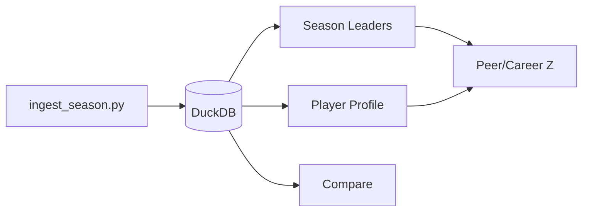
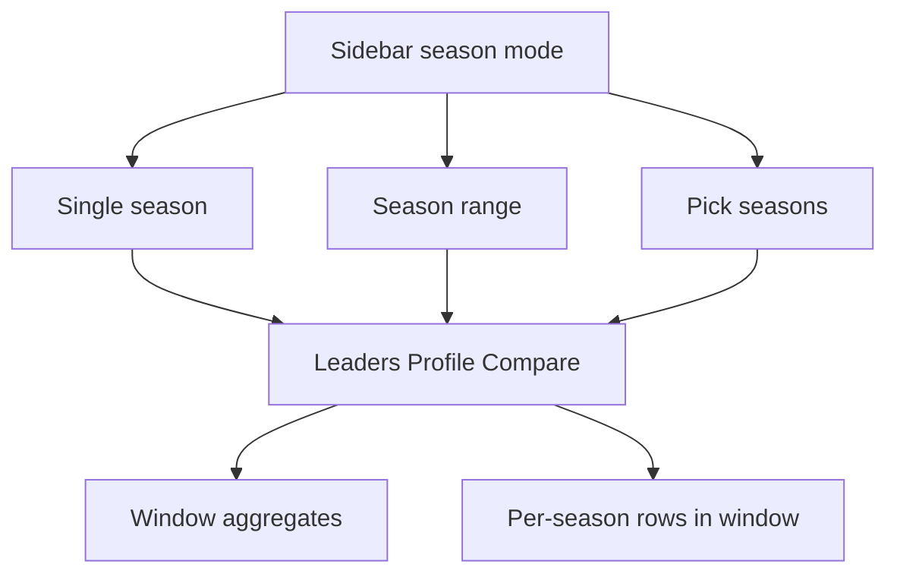

# Fantasy Tracker Enhancement Roadmap (Polish + Analytics)

Saved for implementation in a future session. Focus: **polish** existing pages, **deeper fantasy analytics** on data we already ingest, and a **multi-season window** for continual views (range or hand-picked years). Custom scoring is planned in [CUSTOM_SCORING.md](CUSTOM_SCORING.md). No new nflverse fields; no CI requirement.

---

## Expectations vs draft rank (done — NFL)

FantasyPros expert consensus (ECR) via `nflreadpy.load_ff_rankings()`:

- Ingest: `scripts/ingest_rankings.py` → `ecr_draft`, `ecr_weekly`
- **Season:** draft ECR vs volume-qualified finish rank (`rank_delta` = draft ECR − finish; positive = beat draft rank)
- **Weekly:** weekly ECR vs qualified weekly finish on Profile
- UI: Season Leaders (**Winners & losers**, sort by rank Δ), Profile, Compare (single season)
- Attribution: FantasyPros / DynastyProcess; ranks are not the same as sidebar scoring presets

---

## What we have today (strengths)

The app delivers a coherent **historical fantasy research** loop: ingest REG seasons into DuckDB, explore leaders, drill into careers, and compare head-to-head—with sensible rules for offense vs K vs DST.

**Out of scope (this doc)**
- Playoffs, live weeks, snap counts, red-zone, or other new nflverse columns

**Planned separately:** [Custom scoring](CUSTOM_SCORING.md) — user-defined presets on current stats (no league import).
- FP per attempt / FP per carry / FP per target (too granular for typical fantasy use)
- GitHub Actions / CI (not needed at current project maturity)

---

## Theme A — Polish and consistency

### A1. Analytics plumbing

| Issue | Location | Proposed fix |
|-------|----------|--------------|
| ~~Z-score logic duplicated inline~~ | Season Leaders | Done — `enrich_leaders_dataframe` in `src/analytics/peer_z.py` |
| **Best week** always uses half-PPR for offense | `scripts/ingest_season.py` | Compute best week from `weekly_stats` using **sidebar preset**, or label UI clearly: “Best week (Half-PPR)” |
| K peer Z gaps | `src/analytics/thresholds.yaml` | Add `K` volume gate (e.g. min games / attempts via existing gate pattern) |
| DST peer Z + min games | `dst_season_leaders`, sidebar min games | **Do not apply min games to DST** — a team defense plays every week; peer Z cohort is all teams that season. Optionally skip min-games filter in `dst_season_leaders` entirely |
| Career Z on Compare | `app/pages/3_Compare.py` | Add career Z in single-season mode (reuse `compute_career_z` + qualification rules from Profile) |

### A2. UX completeness

| Enhancement | Pages | Notes |
|-------------|-------|-------|
| **CSV export** | Compare, Player Profile | Mirror Season Leaders download |
| **Era Z on Profile** | Player Profile | Sidebar toggle already on Leaders |
| **Weekly FP chart** | Player Profile | Season chart exists in `app/charts.py`; add weekly line for sidebar season |
| **Leader → Profile link** | Season Leaders | Pre-fill search via query params or session state (`player_id` / `dst:TEAM`) |
| **Scoring captions** | All pages | Offense = sidebar preset; K/DST = ESPN |

### A3. Reliability (lightweight)

- ~~“Repair DB” button~~ — sidebar **Repair database** (games, player index, display names, weekly opponents); not run on every app load

---

## Theme B — Deeper fantasy analytics (existing columns only)

Uses **fantasy points**, **games**, and weekly totals only—no new ingest fields.

### B1. FP per game (season level)

- **FP per game** = `fantasy_points / games`
- Season Leaders: sortable column
- Player Profile: career table column
- Compare: single-season and all-time context where useful

Answers: “Who was better on a **per-game** basis, not just volume of games played?”

### B2. Consistency and boom/bust (weekly data)

From `weekly_stats` using sidebar offensive preset (or ESPN for K/DST):

| Metric | Fantasy meaning |
|--------|-----------------|
| **Weekly FP std dev** | Consistency (lower = steadier floor) |
| **Boom rate** | Share of weeks above a position threshold (e.g. weekly FP ≥ P75 for that position/season) |
| **Bust rate** | Share of weeks below P25 or near-zero FP |
| **Best / worst week** | Season-level best week already stored; weekly table shows range |

**Profile**: “Consistency” panel when sidebar season is set.  
**Compare (single season)**: side-by-side boom/bust + consistency for two players.

### B3. Era and career context

- **Prime seasons**: count of qualified seasons with `career_z > 1`
- **Peak season**: highlight max FP year on profile
- **Compare all-time**: overlay both players’ FP by season (matplotlib, like Profile)

### B4. Where to surface metrics

**First analytics slice (recommended order)**
1. FP per game — Leaders + Profile
2. Weekly consistency + boom/bust — Profile (selected season)
3. Compare single-season — consistency metrics + optional weekly FP overlay

---

## Theme C — Multi-season selection (continual view)

Today the sidebar exposes a single **Season** (`app/components.py`); queries use `WHERE season = ?`. Several metrics and labels assume **one season per context** (peer Z for “this year,” weekly charts, team filter for one year). A **continual view** lets users analyze a **window** of completed seasons—continuous range (e.g. 2018–2022) or arbitrary picks (2019, 2021, 2024)—without replacing single-season drill-down.

### C1. Sidebar UX

| Mode | Control | Result |
|------|---------|--------|
| **Single season** | Current selectbox | `seasons = [year]` — no behavior change |
| **Season range** | Start / end year | All ingested seasons in `[start, end]` |
| **Pick seasons** | Multiselect | Non-contiguous list, sorted deduped |

Optional shortcuts later: “Last 3 / 5 seasons,” “All ingested.”

Shared helper (proposed): `src/season_selection.py` — `parse_season_selection(...)`, `format_season_label(seasons)` → `"2018–2022"` or `"2019, 2021, 2024"`.

Sidebar returns `seasons: list[int]` (and optionally `season_mode`) instead of only `season: int`. Pages that need one year for detail keep a **detail season** control when `len(seasons) > 1`.

### C2. Per-page behavior (v1)

| Page | Continual view (v1) | Single-season detail |
|------|---------------------|----------------------|
| **Season Leaders** | **Window leaders:** rank by total FP and **FP/G** over window (`sum(FP) / sum(games)`); show seasons qualified in window | Optional later: table of one row per player-season filtered to window |
| **Player Profile** | Filter/highlight career chart + table to selected years; **window summary** (total FP, FP/G, qualified seasons count) | Weekly chart, team splits, peer Z for **one** season via detail picker |
| **Compare** | New mode **Selected seasons** (subset of all-time): merge/filter career rows to `season IN (...)` | Keep **Single season** and **All-time** as today |

**Not v1:** concatenated weekly timeline across multiple seasons (noisy for long windows); “window peer Z” pooling all player-seasons in the window (see ambiguity below).

### C3. Metric ambiguity (single-season assumptions)

Many analytics were designed for **one season at a time**. Document behavior in UI captions when the window has multiple years.

| Metric | Single-season meaning | Multi-season stance (recommended) |
|--------|----------------------|-----------------------------------|
| **Peer Z (season)** | vs qualified peers that year | **Per player-season row only** — each year vs its own peer cohort; do not average Z across years without relabeling |
| **Peer Z (era)** | vs all ingested player-seasons | Unchanged; optional note when window ⊂ all ingested data |
| **Career Z** | vs player’s own career mean/std | Window summary can show career Z **per season row**; aggregate “career Z for the window” is a **new** metric if ever added |
| **Best week** | One season’s peak week | Window leaders use **sum/avg FP**, not best week across years unless defined (e.g. max single-week FP in window — label explicitly) |
| **Boom/bust / weekly std** | One season’s week distribution | **Detail season only** until window weekly logic is specified |
| **Min games** | Gate per season | Apply **per season** before aggregating into window totals; only count seasons where `games >= min_games` |
| **DST min games** | Do not gate DST by min games | Same in window mode — DST window totals include every season in range |
| **Team filter (Leaders)** | Teams in one season | Union teams across selected seasons, or hide team filter in multi mode until defined |

**Principle:** Window analytics favor **additive stats** (total FP, FP/G, games, seasons played). **Z-scores and weekly shape metrics** stay **season-scoped** unless we add explicitly labeled window variants.

### C4. Query / data layer

- Extend `season_leaders`, `season_stats_for_peer_analysis`, `compare_entities`, `teams_for_season`, etc. with `seasons: list[int] | None` → `WHERE season IN (...)`.
- New: `season_leaders_window(conn, seasons, ...)` — aggregate after per-season min-games filter.
- CSV export names include window label: `leaders_2018-2022.csv`.

---

## Phasing

### Phase 1 — Polish foundation
- Consolidate Z-score code path
- K peer Z on leaders; DST peer Z without min-games filter
- Best-week preset honesty (label or query-time)
- CSV export on Compare + Profile

### Phase 2 — Core fantasy analytics
- FP per game (Leaders, Profile, Compare as needed)
- New `src/analytics/consistency.py` (weekly std, boom/bust from `weekly_stats`)
- Profile: weekly FP chart + consistency panel

### Phase 3 — Compare and navigation
- Compare: career Z, consistency, dual-player season chart
- Leader → Profile deep link
- Era Z on Profile

### Phase 4 — Multi-season continual view (Theme C)
- Sidebar: Single | Range | Pick seasons → `seasons[]`
- Compare: **Selected seasons** mode
- Season Leaders: window aggregate (total FP, FP/G, seasons in window)
- Player Profile: career filter + window summary; detail season for weekly/peer Z
- Document metric captions for multi-year context (Theme C3 table)

**Depends on:** Phase 2 FP/G (window FP/G reuses same definition). Can start Compare subset + sidebar plumbing in parallel with Phase 3 if desired.

---

## Deferred

- Playoff tables, IDP, strength of schedule
- Custom scoring — see [CUSTOM_SCORING.md](CUSTOM_SCORING.md) (no league import)
- FP per attempt / carry / target
- CI / GitHub Actions
- Multi-season concatenated weekly timeline; window-level peer Z without clear labeling

---

## Success criteria

After Phase 1–2, users can answer:

- “Who produced more **per game**, not just total season points?” → FP/G
- “Was he **consistent** or boom/bust?” → weekly std, boom/bust rates
- “How does this year rank vs **career** and **peers**?” → career Z + peer Z (qualified seasons; DST vs all teams, not min-games gated)

After Phase 4, users can additionally answer:

- “Who dominated **2018–2022** on total points and **per game**?” → window Leaders
- “How do these two players stack up over **the same era slice**?” → Compare selected seasons
- “Show me this player’s **prime window** on the career chart” → Profile filtered years + window summary

All on **completed REG seasons** with existing ingest.

---

## Implementation todos

- [x] **Phase 1:** Z helpers, K/DST peer Z (DST skips min games), best-week clarity, CSV exports
- [x] **Phase 2:** FP/game, `consistency.py`, Profile weekly chart + consistency panel
- [x] **Phase 3:** Compare career Z + consistency + charts, Leader→Profile, Era Z on Profile
- [x] **Pre–Phase 4 (session polish):** Leader name links, weekly opponent + repair backfill, Compare union/shared season sidebar + cross-era all-time, dev file-watcher off
- [x] **Phase 4:** Multi-season sidebar (single/range/pick), window Leaders, Compare selected seasons, Profile window filter + summary, metric ambiguity captions (Theme C3)
