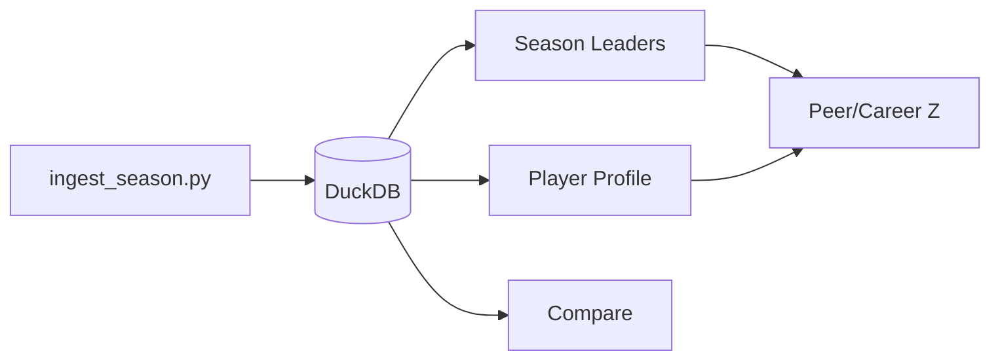

# Fantasy Tracker Enhancement Roadmap (Polish + Analytics)

Saved for implementation in a future session. Focus: **polish** existing pages and **deeper fantasy analytics** on data we already ingest. No custom scoring, no new nflverse fields, no CI requirement.

---

## What we have today (strengths)

The app delivers a coherent **historical fantasy research** loop: ingest REG seasons into DuckDB, explore leaders, drill into careers, and compare head-to-head—with sensible rules for offense vs K vs DST.

**Out of scope**
- Custom league / scoring builders
- Playoffs, live weeks, snap counts, red-zone, or other new nflverse columns
- FP per attempt / FP per carry / FP per target (too granular for typical fantasy use)
- GitHub Actions / CI (not needed at current project maturity)

---

## Theme A — Polish and consistency

### A1. Analytics plumbing

| Issue | Location | Proposed fix |
|-------|----------|--------------|
| Z-score logic duplicated inline | `app/pages/1_Season_Leaders.py` vs unused `enrich_season_with_z_scores` in `src/analytics/variance.py` | Wire Season Leaders through shared helpers in `src/analytics/peer_z.py` |
| **Best week** always uses half-PPR for offense | `scripts/ingest_season.py` | Compute best week from `weekly_stats` using **sidebar preset**, or label UI clearly: “Best week (Half-PPR)” |
| K peer Z gaps | `src/analytics/thresholds.yaml` | Add `K` volume gate (e.g. min games / attempts via existing gate pattern) |
| DST peer Z + min games | `dst_season_leaders`, sidebar min games | **Do not apply min games to DST** — a team defense plays every week; peer Z cohort is all teams that season. Optionally skip min-games filter in `dst_season_leaders` entirely |
| Career Z on Compare | `app/pages/3_Compare.py` | Add career Z in single-season mode (reuse `compute_career_z` + qualification rules from Profile) |

### A2. UX completeness

| Enhancement | Pages | Notes |
|-------------|-------|-------|
| **CSV export** | Compare, Player Profile | Mirror Season Leaders download |
| **Era Z on Profile** | Player Profile | Sidebar toggle already on Leaders |
| **Weekly FP chart** | Player Profile | Season chart exists in `app/charts.py`; add weekly line for sidebar season |
| **Leader → Profile link** | Season Leaders | Pre-fill search via query params or session state (`player_id` / `dst:TEAM`) |
| **Scoring captions** | All pages | Offense = sidebar preset; K/DST = ESPN |

### A3. Reliability (lightweight)

- Document when `recompute_games_played` / `rebuild_players_table` run on app start (`app/components.py`)
- Optional later: “Repair DB” button or move maintenance to ingest-only to speed Streamlit reloads

---

## Theme B — Deeper fantasy analytics (existing columns only)

Uses **fantasy points**, **games**, and weekly totals only—no new ingest fields.

### B1. FP per game (season level)

- **FP per game** = `fantasy_points / games`
- Season Leaders: sortable column
- Player Profile: career table column
- Compare: single-season and all-time context where useful

Answers: “Who was better on a **per-game** basis, not just volume of games played?”

### B2. Consistency and boom/bust (weekly data)

From `weekly_stats` using sidebar offensive preset (or ESPN for K/DST):

| Metric | Fantasy meaning |
|--------|-----------------|
| **Weekly FP std dev** | Consistency (lower = steadier floor) |
| **Boom rate** | Share of weeks above a position threshold (e.g. weekly FP ≥ P75 for that position/season) |
| **Bust rate** | Share of weeks below P25 or near-zero FP |
| **Best / worst week** | Season-level best week already stored; weekly table shows range |

**Profile**: “Consistency” panel when sidebar season is set.  
**Compare (single season)**: side-by-side boom/bust + consistency for two players.

### B3. Era and career context

- **Prime seasons**: count of qualified seasons with `career_z > 1`
- **Peak season**: highlight max FP year on profile
- **Compare all-time**: overlay both players’ FP by season (matplotlib, like Profile)

### B4. Where to surface metrics

**First analytics slice (recommended order)**
1. FP per game — Leaders + Profile
2. Weekly consistency + boom/bust — Profile (selected season)
3. Compare single-season — consistency metrics + optional weekly FP overlay

---

## Phasing

### Phase 1 — Polish foundation
- Consolidate Z-score code path
- K peer Z on leaders; DST peer Z without min-games filter
- Best-week preset honesty (label or query-time)
- CSV export on Compare + Profile

### Phase 2 — Core fantasy analytics
- FP per game (Leaders, Profile, Compare as needed)
- New `src/analytics/consistency.py` (weekly std, boom/bust from `weekly_stats`)
- Profile: weekly FP chart + consistency panel

### Phase 3 — Compare and navigation
- Compare: career Z, consistency, dual-player season chart
- Leader → Profile deep link
- Era Z on Profile

---

## Deferred

- Playoff tables, IDP, strength of schedule
- Custom scoring / platform importers
- FP per attempt / carry / target
- CI / GitHub Actions

---

## Success criteria

After Phase 1–2, users can answer:

- “Who produced more **per game**, not just total season points?” → FP/G
- “Was he **consistent** or boom/bust?” → weekly std, boom/bust rates
- “How does this year rank vs **career** and **peers**?” → career Z + peer Z (qualified seasons; DST vs all teams, not min-games gated)

All on **completed REG seasons** with existing ingest.

---

## Implementation todos

- [ ] **Phase 1:** Z helpers, K/DST peer Z (DST skips min games), best-week clarity, CSV exports
- [ ] **Phase 2:** FP/game, `consistency.py`, Profile weekly chart + consistency panel
- [ ] **Phase 3:** Compare career Z + consistency + charts, Leader→Profile, Era Z on Profile
