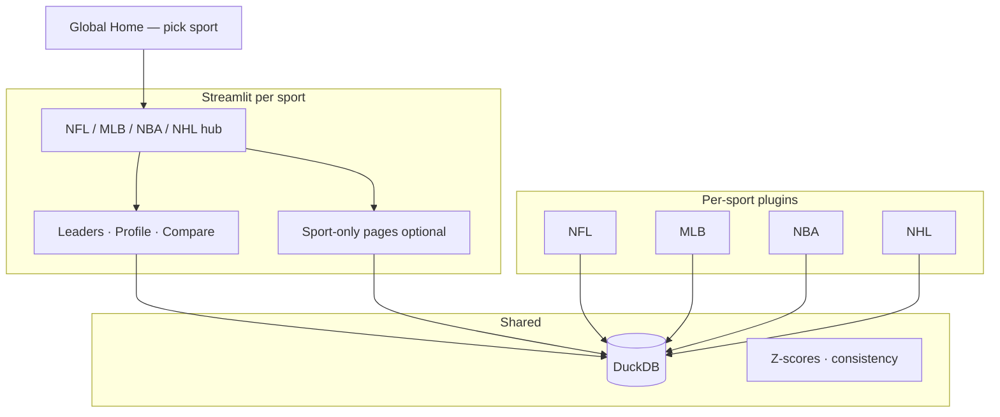

# Multi-Sport Expansion (Brainstorm)

Brainstorm for growing Fantasy Tracker beyond NFL. **Analytics pages stay the same pattern within a sport** (Leaders, Profile, Compare); **never compare across sports** (no NHL vs NBA).

**Build NFL enhancements first:** [ENHANCEMENT_ROADMAP.md](ENHANCEMENT_ROADMAP.md)

---

## Core idea

Add a **sport** dimension everywhere: ingest, players, scoring presets, volume gates, and queries are scoped to one sport at a time.

**Navigation (locked in):** **Per-sport entry**, not a single global “sport” dropdown buried in the sidebar.

- **Global home** — pick NFL | MLB | NBA | NHL (tile or links).
- **Per-sport hub** — sport-specific landing (ingest status, data source, season labels, quick links).
- **Per-sport pages** — shared Leaders / Profile / Compare under that sport’s section; optional **sport-only** pages (e.g. NFL beat-draft-rank, MLB hitter vs pitcher leaders) without cluttering other sports.

The sidebar within a sport keeps **season window**, **scoring**, **min games**, etc. It does **not** switch sports mid-flow (avoids mixing presets, positions, and stat columns).



**Example layout (Streamlit multipage):**

```text
app/
  Home.py                    # Sport picker → links to hubs
  pages/
    nfl/
      0_NFL_Home.py
      1_Season_Leaders.py
      2_Player_Profile.py
      3_Compare.py
      # optional: rankings / NFL-only tools
    mlb/
      0_MLB_Home.py
      1_Hitter_Leaders.py    # optional split vs one Leaders page
      2_Pitcher_Leaders.py
      ...
```

Phase 0 can keep today’s flat `app/pages/` paths and introduce folders when the second sport lands.

---

## What maps from today’s NFL app

**Reuses well**
- Page *patterns* (Leaders, Profile, Compare) and shared components (`render_sidebar`, charts, Z-score helpers)
- DuckDB + manifest + player search (with `sport` on keys)
- Scoring: built-in YAML + [custom presets](CUSTOM_SCORING.md) (`scoring_presets.sport`)
- Peer Z / career Z with sport-specific volume gates
- Compare cohort rules (within sport only)

**Per-sport (not shared UI copy)**
- Hub / landing copy, ingest commands, data licenses
- Sidebar defaults (positions, min games, scoring labels)
- Stat columns and custom-scoring weight editor allowlist
- Optional extra pages (see [Navigation](#core-idea))

**Differs by sport**
| Topic | NFL | MLB | NBA | NHL |
|-------|-----|-----|-----|-----|
| Time grain | Week | Game / date | Game | Game |
| Special units | K, DST (team) | SP / RP vs hitters | — | Goalies vs skaters |
| Min games for “units” | DST: none (every game) | TBD (IP / PA gates) | Min games played | Skaters: min GP; goalies separate |
| Season label | 2023 | 2024 | 2023–24 | 2023–24 |

---

## Architecture: sport plugins (recommended)

**Phase 0:** Refactor NFL into `src/sports/nfl/` without changing the UI.

```
src/sports/
  registry.py       # metadata + dispatch
  nfl/              # current code, moved
  mlb/
  nba/
  nhl/
```

**Database:** One `fantasy_tracker.duckdb`.

**Shared dimension tables** (composite keys include `sport`):
- `ingest_manifest(sport, season_year)`
- `players(sport, player_id)`
- `scoring_presets(sport, …)` — already has `sport`

**Per-sport stat tables** (typed columns, no universal mega-table):
- NFL: keep / rename `weekly_stats`, `season_stats`, `season_team_stats`, `team_defense_*` (week = game index)
- MLB: e.g. `mlb_player_game_stats`, `mlb_player_season_stats` (hits, HR, IP, K, …)
- NBA / NHL: same idea — only columns that sport ingests

Stats differ by sport; do **not** add all sports’ columns to one `player_game_stats` row. The sport plugin owns schema, ingest, stat allowlists for custom scoring, and `fantasy_points_sql_expr` for that sport.

```text
Shared: players, ingest_manifest, scoring_presets, (rankings per sport if any)
NFL-only facts: weekly_stats, season_stats, team_defense_*
MLB-only facts: mlb_* tables
…
```

---

## Data sources (realistic options)

### NFL (current)
- **[nflreadpy](https://nflreadpy.nflverse.com/)** / nflverse — weekly player + team stats, 1999+, REG. **Best-in-class; already integrated.**

### MLB
- **[pybaseball](https://github.com/jldbc/pybaseball)** — FanGraphs / Baseball Reference season batting & pitching. **Best v1 for season-long fantasy totals.**
- Statcast via pybaseball — pitch-level; huge; optional later.
- [sportsdataverse](https://pypi.org/project/sportsdataverse/) — alpha; possible unified loader, less proven for MLB season aggregates.

### NBA
- **[nba_api](https://github.com/swar/nba_api)** — game logs and player stats from NBA Stats API. **Primary Python path.**
- [hoopR](https://hoopr.sportsdataverse.org/) — R-first; reference only unless you add R ingest.

### NHL
- **[nhl-api-py](https://pypi.org/project/nhl-api-py/)** — skater + goalie stats, schedules, rosters.
- [sportsdataverse NHL](https://py.sportsdataverse.org/docs/nhl/) — PBP/schedules; complementary.

### Platform APIs (not primary warehouse)
- **Yahoo YFPY** / **ESPN API** — league-scored fantasy points, OAuth, league-specific. Useful later for “my league settings,” not for historical open research across all seasons.
- **FantasyPros ECR** (`ingest_rankings.py`) — NFL-only expectations layer today; other sports would need their own rank/ADP source if added later.

**There is no single nflverse-quality package for all sports.** Expect per-sport ingest scripts and more upstream breakage than NFL.

---

## Compare and cohort rules (per sport)

Same pattern as NFL today (offense cross-position OK; special units isolated):

| Sport | Compare cohorts (examples) |
|-------|----------------------------|
| NFL | QB/RB/WR/TE together; K alone; DST alone |
| MLB | Hitters together; pitchers alone |
| NBA | All lineup positions (or G/F/C groupings) |
| NHL | Skaters together; goalies alone |

Hard rule: **Compare never crosses sports** (enforced by separate page trees / session scope — no cross-sport entity picker).

---

## Suggested rollout

1. **Phase 0** — NFL plugin extraction + `sport` on shared tables; document per-sport stat table policy; global home + NFL hub (can alias current pages)  
2. **Phase 1** — MLB plugin + `mlb_*` stat tables + `app/pages/mlb/` hub and core pages  
3. **Phase 2** — NBA (`nba_*` tables + pages)  
4. **Phase 3** — NHL (`nhl_*` tables + pages)  

Optional: unified CLI `ingest.py --sport mlb --season 2024`

---

## Out of scope (initial multi-sport v1)

- Cross-sport Compare or leaderboards  
- Playoffs, live in-season sync, play-by-play warehouses  

**NFL already shipped:** [Custom scoring](CUSTOM_SCORING.md) v1 (offense presets); extend per sport via plugin stat allowlists.  
- FP per attempt / carry / target (see NFL enhancement doc)  
- IDP, roto-only baseball without a points preset  

---

## Decisions (locked in)

1. **First new sport after Phase 0:** MLB (pybaseball)  
2. **MLB v1 scoring:** Points league only (ESPN-style default) — roto deferred  
3. **Database:** Single DuckDB; `sport` on shared metadata; **separate stat tables per sport**  
4. **Navigation:** Global home → **per-sport hub** → shared analytics pages (+ sport-only pages as needed). Not a single sidebar sport switcher for the whole app.

## Open decisions

1. App branding: keep “Fantasy Tracker” vs rename  
2. NBA/NHL season key: calendar year vs `2023-24` string in UI  
3. Streamlit folder naming: `pages/nfl/` vs top-level `NFL_Leaders.py` prefixes until second sport ships  

---

## Why per-sport pages (not one filter)

| Need | Per-sport hub + pages |
|------|------------------------|
| Different ingest CLI and coverage on landing | ✓ |
| Position taxonomy (DST/K vs hitter/pitcher vs goalie) | ✓ |
| Sport-only features (NFL ECR / beat draft rank) | ✓ without hiding behind a filter |
| Custom scoring stat editor | ✓ plugin allowlist per sport |
| Season label UX (`2023` vs `2023–24`) | ✓ |
| Extra leaders (MLB pitchers vs hitters) | ✓ optional pages |

A sidebar-only sport dropdown stays possible for prototypes but **does not** scale when sport-specific nav and copy diverge.

---

## Checklist (when implementation starts)

- [x] Phase 0: `src/sports/nfl/` + `sport` on shared tables; NFL stat tables unchanged  
- [x] Phase 0: Global home sport picker + NFL hub page; `app/sport_context.py` scopes pages  
- [x] Phase 1: MLB ingest + `mlb_*` stat tables + `app/pages/mlb/` hub and core pages  
- [x] Phase 2: NBA tables + pages (`scripts/ingest_nba.py`)  
- [x] Phase 3: NHL tables + pages (`scripts/ingest_nhl.py`)  
- [x] Per-sport ingest commands in registry + `scripts/ingest.py --sport …`  

**Note:** NFL Profile/Compare remain at `app/pages/2_*` and `3_*` (full analytics); MLB/NBA/NHL Profile/Compare are v1 season-row views until game-level ingest lands.
