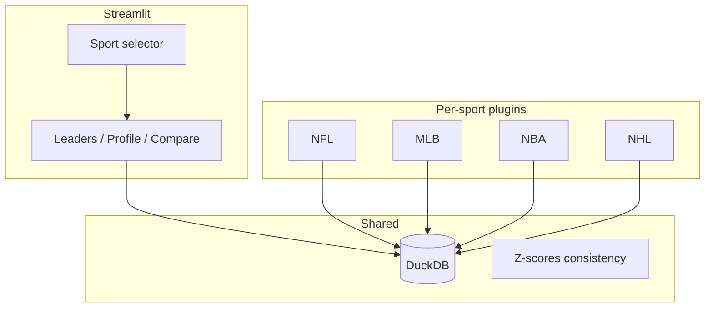

# Multi-Sport Expansion (Brainstorm)

Brainstorm for growing Fantasy Tracker beyond NFL. **Pages stay the same within a sport**; never compare across sports (no NHL vs NBA).

**Build NFL enhancements first:** [ENHANCEMENT_ROADMAP.md](ENHANCEMENT_ROADMAP.md)

---

## Core idea

Add a **sport** dimension everywhere: sidebar selects NFL | MLB | NBA | NHL, and all queries, ingest, positions, and scoring presets are scoped to that sport.



---

## What maps from today’s NFL app

**Reuses well**
- Streamlit pages (Leaders, Profile, Compare)
- DuckDB + manifest + player search
- YAML scoring presets → precomputed fantasy points at ingest
- Peer Z / career Z with sport-specific volume gates
- Compare cohort rules (within sport only)

**Differs by sport**
| Topic | NFL | MLB | NBA | NHL |
|-------|-----|-----|-----|-----|
| Time grain | Week | Game / date | Game | Game |
| Special units | K, DST (team) | SP / RP vs hitters | — | Goalies vs skaters |
| Min games for “units” | DST: none (every game) | TBD (IP / PA gates) | Min games played | Skaters: min GP; goalies separate |
| Season label | 2023 | 2024 | 2023–24 | 2023–24 |

---

## Architecture: sport plugins (recommended)

**Phase 0:** Refactor NFL into `src/sports/nfl/` without changing the UI.

```
src/sports/
  registry.py       # metadata + dispatch
  nfl/              # current code, moved
  mlb/
  nba/
  nhl/
```

**Database:** One `fantasy_tracker.duckdb`, composite keys with `sport`:
- `ingest_manifest(sport, season_year)`
- `players(sport, player_id)`
- `player_game_stats` — generalizes `weekly_stats` (NFL: `game_number` = week)
- `player_season_stats`
- NFL-only: `team_defense_*` tables

Avoid one table with hundreds of nullable columns for all sports.

---

## Data sources (realistic options)

### NFL (current)
- **[nflreadpy](https://nflreadpy.nflverse.com/)** / nflverse — weekly player + team stats, 1999+, REG. **Best-in-class; already integrated.**

### MLB
- **[pybaseball](https://github.com/jldbc/pybaseball)** — FanGraphs / Baseball Reference season batting & pitching. **Best v1 for season-long fantasy totals.**
- Statcast via pybaseball — pitch-level; huge; optional later.
- [sportsdataverse](https://pypi.org/project/sportsdataverse/) — alpha; possible unified loader, less proven for MLB season aggregates.

### NBA
- **[nba_api](https://github.com/swar/nba_api)** — game logs and player stats from NBA Stats API. **Primary Python path.**
- [hoopR](https://hoopr.sportsdataverse.org/) — R-first; reference only unless you add R ingest.

### NHL
- **[nhl-api-py](https://pypi.org/project/nhl-api-py/)** — skater + goalie stats, schedules, rosters.
- [sportsdataverse NHL](https://py.sportsdataverse.org/docs/nhl/) — PBP/schedules; complementary.

### Platform APIs (not primary warehouse)
- **Yahoo YFPY** / **ESPN API** — league-scored fantasy points, OAuth, league-specific. Useful later for “my league settings,” not for historical open research across all seasons.

**There is no single nflverse-quality package for all sports.** Expect per-sport ingest scripts and more upstream breakage than NFL.

---

## Compare and cohort rules (per sport)

Same pattern as NFL today (offense cross-position OK; special units isolated):

| Sport | Compare cohorts (examples) |
|-------|----------------------------|
| NFL | QB/RB/WR/TE together; K alone; DST alone |
| MLB | Hitters together; pitchers alone |
| NBA | All lineup positions (or G/F/C groupings) |
| NHL | Skaters together; goalies alone |

Hard rule: **Compare never crosses sports** (enforced via single sidebar sport).

---

## Suggested rollout

1. **Phase 0** — NFL plugin extraction + `sport` column + rename weekly → game stats conceptually  
2. **Phase 1** — MLB (pybaseball, season + game, hitter/pitcher)  
3. **Phase 2** — NBA (nba_api, game logs)  
4. **Phase 3** — NHL (nhl-api-py, skater/goalie)  

Optional: unified CLI `ingest.py --sport mlb --season 2024`

---

## Out of scope (initial multi-sport v1)

- Cross-sport Compare or leaderboards  
- Custom league / platform scoring import  
- Playoffs, live in-season sync, play-by-play warehouses  
- FP per attempt / carry / target (see NFL enhancement doc)  
- IDP, roto-only baseball without a points preset  

---

## Decisions (locked in)

1. **First new sport after Phase 0:** MLB (pybaseball)  
2. **MLB v1 scoring:** Points league only (ESPN-style default) — roto deferred  
3. **Database:** Single DuckDB + `sport` column (recommended default)

## Open decisions

1. App branding: keep “Fantasy Tracker” vs rename  
2. NBA/NHL season key: calendar year vs `2023-24` string in UI  

---

## Checklist (when implementation starts)

- [ ] Phase 0: `src/sports/nfl/` + sport-scoped schema migration  
- [ ] Phase 1: MLB ingest + sidebar sport switch  
- [ ] Phase 2: NBA  
- [ ] Phase 3: NHL  
- [ ] Per-sport README sections (data source, license, ingest command)  
