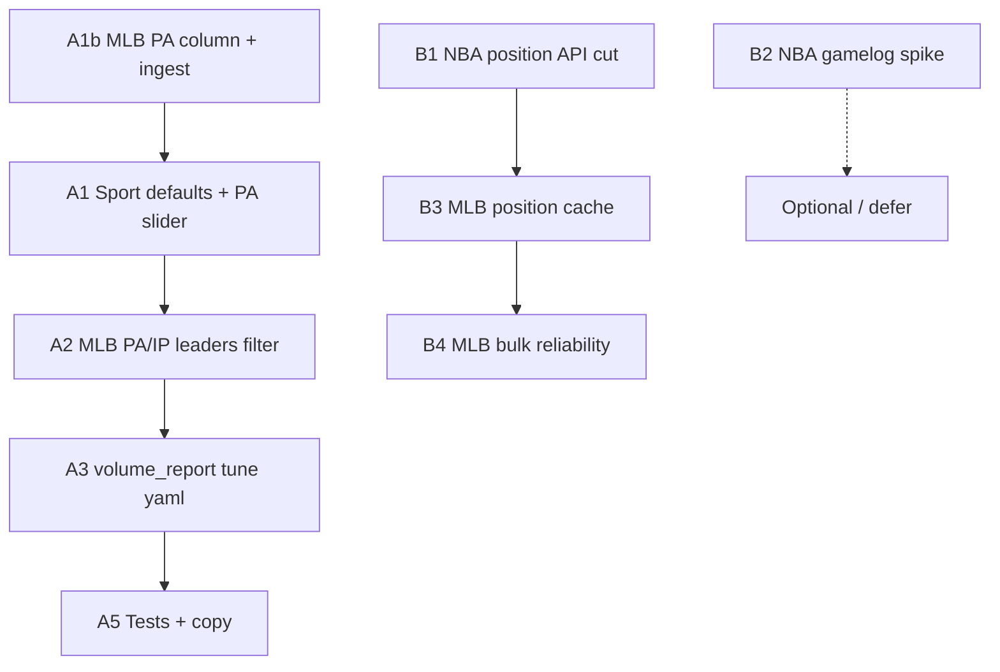

# Next session plan: volume gates + ingest performance

Execution plan for a follow-up session. Builds on current behavior: sport-specific `volume_gates_by_sport` in `src/analytics/thresholds.yaml`, MLB hitter/pitcher cohort split on leaders/compare, per-team rows for MLB/NHL, and `scripts/volume_report.py` for calibration.

---

## Goals

1. **Trustworthy leaders & Z-scores** for MLB / NBA / NHL with sport-appropriate minimum volume (especially MLB hitters vs pitchers).
2. **Faster, more reliable ingest** for MLB (BRef / FanGraphs) and NBA (`nba_api`), without sacrificing data quality.
3. **Clear UX** so users understand what “min games” means per sport and cohort.

### Decisions (locked in)

| Topic | Decision |
|--------|----------|
| MLB hitter volume | **Plate appearances (PA)**, not games — pinch-hitters and defensive subs can inflate G without meaningful batting volume. |
| MLB pitcher volume | **Innings pitched** (SP/RP thresholds in yaml). |
| NBA positions | **PlayerIndex-first** (drop 30 roster calls if coverage is good). |
| NBA game logs | **Optional / slow path** — don’t block season ingest on full gamelog speed. |
| API cache | **`data/cache/`** gitignored; manifests optional. |
| Session order | **A1 → A2 → A3 → B1 → B3 → B4**; B2 spike optional. |

---

## Track A — Volume thresholds (leaders + peer/career Z)

### A0. Current state (baseline)

| Layer | What it does today |
|--------|-------------------|
| Sidebar `min_games` | Single default **8** from `config/settings.yaml` (NFL-shaped). Filters **season leader** SQL for all sports. |
| `volume_gates_by_sport` | Extra qualification for **peer Z** and **career Z** only (`qualifies_for_peer_z_sport`). |
| MLB yaml | `default.games: 50`, `SP.innings_pitched: 50`, `RP.innings_pitched: 20` — **no `plate_appearances` column in DB yet**. |
| NBA / NHL yaml | `default.games: 41`, NHL `G.games: 20`. |
| MLB leaders gap | Pitching board still filtered by **games only** in SQL — relievers with many G but low IP can appear if sidebar min is low. Hitters should use **PA** once ingested. |
| MLB 2020 | Career Z omitted (COVID-shortened season). |
| MLB schema | `plate_appearances` **not** in `mlb_player_season_stats` today — must add in **A1b** before PA gates work. |

### A1b. MLB ingest + schema: `plate_appearances`

**Why:** PA is the hitter volume metric; BRef / FanGraphs both expose it (pybaseball batting frames: `PA`).

**Tasks:**

- [ ] Add `plate_appearances` to `MLB_PLAYER_SEASON_COLUMNS`, DDL, and `_migrate_mlb_player_season_stats` (nullable default 0 for old rows until re-ingest).
- [ ] `scripts/ingest_mlb.py` — map BRef `PA` and FanGraphs `PA` in `_batting_frame_*`; sum in `consolidate_mlb_season_frame` like other counting stats.
- [ ] Pitcher rows: `plate_appearances = 0` (or omit; hitters-only gate).
- [ ] `src/analytics/volume_report.py` — include PA in MLB hitter summaries for calibration.
- [ ] Re-ingest at least one recent season to validate.

**Acceptance:** `SELECT plate_appearances FROM mlb_player_season_stats WHERE position = 'OF' LIMIT 5` shows sensible totals (~300–700 for regulars).

### A1. Sport-specific sidebar defaults

**Why:** 8 games is wrong for a 162-game MLB season; NBA/NHL want ~half a season, not 8.

**Tasks:**

- [ ] Add `min_games_default_by_sport` in `config/settings.yaml` (or extend `settings.yaml` with nested keys).
- [ ] `get_min_games_default(sport_id)` in `src/settings.py` with NFL fallback.
- [ ] `render_sidebar()` in `app/components.py`: use sport default for slider `value=`; keep per-sport `max_value` (already 162 / 82 / 17).
- [ ] Optional: show sport default in slider help text.

**Suggested starting defaults (tune after A3):**

| Sport | Leader / sidebar gate | Notes |
|--------|------------------------|--------|
| NFL | 8 games | unchanged |
| MLB hitters | **~200 PA** (sidebar or yaml) | Tune with `volume_report`; not games |
| MLB pitchers | IP from yaml | Sidebar “min games” hidden or caption-only for pitching view |
| NBA | 41 games | ~50% of 82 |
| NHL skaters | 41 games | ~50% of 82 |
| NHL goalies | 20 games | matches yaml `G` |

**Tasks (MLB hitter UI):**

- [ ] When MLB + hitter-only selection: label slider **“Min plate appearances”** (or dual caption: “Games shown; qualified by PA”).
- [ ] Store slider value in session; map to `plate_appearances >= N` in queries (not `games`).

**Acceptance:** Opening MLB hitter leaders, default PA threshold is sport-appropriate (not 8); NFL still uses min games.

### A2. MLB leaders: PA for hitters, IP for pitchers

**Why:** Pinch hitters break **games** as a volume proxy; pitchers need **innings pitched**, not games.

**Tasks:**

- [ ] `src/sports/mlb/queries.py` — `season_leaders()` (and window path if applicable):
  - **Hitter-only:** `plate_appearances >= threshold` (sidebar PA default or yaml).
  - **Pitcher-only:** `innings_pitched >= threshold` from yaml (SP vs RP via position).
  - Still **display** `games` in the table.
- [ ] `qualifies_for_peer_z_sport` / yaml: hitter gates use `plate_appearances` (replace `default.games` for field positions).
- [ ] Helper: `mlb_leader_volume_filter(positions, min_volume) -> SQL fragment + params`.
- [ ] Captions on `sport_leaders_page.py`: hitters → PA; pitchers → IP.

**Acceptance:** Player with 40 G but 25 PA excluded on hitter board; RP with 60 G and 15 IP excluded on pitching board; regulars qualify.

### A3. Calibrate yaml with `volume_report`

**Tasks:**

- [ ] Run for 2–3 recent seasons each sport:
  ```bash
  python scripts/volume_report.py --sport mlb --season 2024
  python scripts/volume_report.py --sport nba --season 2024
  python scripts/volume_report.py --sport nhl --season 2024
  ```
- [ ] Target ~**40–60%** of players `qualified` at proposed gates (adjust per position).
- [ ] Replace MLB hitter `default.games` with **`plate_appearances`** (starting point ~200–350; tune from report).
- [ ] Keep `SP` / `RP` **innings_pitched** gates; remove games-based default for hitters.
- [ ] Optional: one `H` legacy bucket in yaml mirroring field positions for peer Z.
- [ ] Commit tuned `thresholds.yaml` + one-line note in this doc with chosen pct_qualified.

**Acceptance:** Documented gate table; peer Z cohorts aren’t dominated by part-time players.

### A4. UI / copy for Z vs leaders

**Tasks:**

- [ ] Sidebar/caption (non-NFL): explain sport-specific gates — MLB hitters **PA**, MLB pitchers **IP**, NBA/NHL **games**. Peer Z uses `thresholds.yaml`.
- [ ] Profile: same captions where career Z / peer Z are explained (MLB already notes 2020).

**Acceptance:** New user can tell why a row has no peer Z.

### A5. Tests

- [ ] `test_mlb_season_leaders.py` — pitcher filter uses IP.
- [ ] `test_sport_variance` or extend — MLB RP fails IP gate, hitter fails PA gate.
- [ ] Ingest/consolidate test — PA sums across team stints.
- [ ] `get_min_games_default("mlb")` unit test.

**Estimated effort:** ~½–1 session.

---

## Track B — MLB / NBA ingest performance

### B0. Where time goes today

#### MLB (`scripts/ingest_mlb.py`)

| Step | Cost driver |
|------|-------------|
| BRef batting + pitching | 2 pybaseball calls/season; **2s sleep** between; up to **5 retries** with backoff on failure |
| `load_field_position_map()` | **Extra BRef HTML scrape** per season (`position_lookup.py`) even after batting stats fetched |
| Bulk loop | **3s sleep** between seasons |
| FanGraphs fallback | Extra calls + 403 risk |

#### NBA (`scripts/ingest_nba.py` + `player_positions.py` + `gamelogs.py`)

| Step | Cost driver |
|------|-------------|
| `LeagueDashPlayerStats` | 1 call/season — fast |
| `fetch_season_positions()` | **~32 calls/season**: `LeagueDashTeamStats` + **30× `CommonTeamRoster`** + `PlayerIndex`, each with **0.6s sleep** → **~20s+ sleeps alone** |
| `ingest_nba_gamelogs.py` | **1 API call per player** (`PlayerGameLog`) × 0.6s → **~5+ min** for full roster |

#### NHL (reference — already reasonable)

- Paginated skater + goalie summaries; 0.25s between pages. **Use as pattern** for batching, not per-entity loops.

### B1. NBA season stats — cut position API calls (high ROI)

**Problem:** 30 roster calls per season dominate ingest.

**Options (pick one primary in session):**

1. **PlayerIndex only** (preferred first try)  
   - Use `_positions_from_player_index` only; drop roster loop unless index coverage &lt; 95%.  
   - **~2 calls/season** instead of ~32.  
   - Validate: compare position map vs roster for one season; log `% missing`.

2. **Cache position maps on disk**  
   - `data/cache/nba/positions_{end_year}.json` with manifest date.  
   - Skip API if cache fresh and `--refresh` not passed.

3. **Roster batching / reduced sleep**  
   - If roster path kept: lower sleep to 0.35s with retry wrapper; parallel not recommended (nba_api rate limits).

**Tasks:**

- [ ] Benchmark: time one season before/after (PlayerIndex-only).
- [ ] Implement chosen approach in `fetch_season_positions()`.
- [ ] CLI flag: `--refresh-positions` to bust cache.

**Acceptance:** NBA `ingest_season` for one year completes in **&lt; 30s** typical (vs minutes today).

### B2. NBA game logs — batch or defer (medium ROI)

**Problem:** Per-player `PlayerGameLog` does not scale.

**Options:**

1. **Defer by default** — Document that game logs are optional; profile shows “no game log” until run.  
2. **League game log endpoint** — Investigate `LeagueGameLog` / bulk endpoints in `nba_api` (one or few calls per season).  
3. **Incremental ingest** — `--limit-players`, `--only-stars`, or ingest top N by minutes from season table.  
4. **Background job** — Progress bar + resume file for partial completion.

**Tasks:**

- [ ] Spike: one season via bulk endpoint if exists; else document “optional slow path”.
- [ ] Add `ingest_nba_gamelogs.py --max-players` / `--min-games 20` default for dev.
- [ ] Optional: store gamelog manifest (`nba_gamelog_manifest`) so UI can say “game logs through 2024-03-01”.

**Acceptance:** Full gamelog ingest is a deliberate opt-in; season stats ingest stays fast.

### B3. MLB — reduce redundant BRef work (high ROI)

**Problem:** Batting stats + separate standard-batting scrape for positions.

**Options:**

1. **Pos from pybaseball batting frame** — If `Pos` column exists on BRef batting stats return, drop `load_field_position_map` for BRef path.  
2. **Cache `load_field_position_map` per year** — JSON on disk; reuse across re-ingests.  
3. **FanGraphs path** — `Pos` on FanGraphs batting_stats; skip BRef position scrape when FG used.

**Tasks:**

- [ ] Inspect pybaseball BRef batting columns for `Pos` / `Tm` per team row (multi-team already separate rows post-consolidate).
- [ ] Only call `load_field_position_map` when Pos missing for &gt; X% of rows.
- [ ] Cache file: `data/cache/mlb/positions_{year}.json`.

**Acceptance:** BRef ingest for one season saves **≥1 HTTP round-trip** and avoids duplicate scrape when Pos in main table.

### B4. MLB — rate limits & bulk ingest (reliability)

**Tasks:**

- [ ] Centralize HTTP retry in `src/sports/mlb/bref_fetch.py` (shared by ingest + position_lookup).
- [ ] Bulk mode: configurable `--delay` (default 3s BRef / 1.5s FG); `--seasons 2022,2023` subset.
- [ ] Failed-season manifest: append to `mlb_ingest_manifest` or `ingest_failures.log` for easy re-run.
- [ ] Document: prefer **single-season re-run** after bulk skip list (already partially there).

**Acceptance:** Bulk 2018–2024 completes overnight with clear skip list; no silent empty seasons.

### B5. Shared ingest infrastructure (nice-to-have)

- [ ] `src/ingest/cache.py` — `read_cache(sport, key)`, `write_cache`, TTL optional.
- [ ] `src/ingest/rate_limit.py` — `sleep_between_calls(sport)` from config.
- [ ] `config/ingest.yaml` — sleeps, retries, cache dir.

**Estimated effort:** 1–1.5 sessions (B1 + B3 first; B2 as spike/doc).

---

## Track C — Quick polish (if time remains)

Lower priority; already discussed in chat.

| Item | Notes |
|------|--------|
| Compare stat diff table (MLB/NHL) | NFL-style side-by-side labeled stats for single-season compare |
| Re-ingest banner | If manifest missing or row_count 0 for selected season |
| Window leaders + peer Z | Document “era Z off for windows” or design window peer metric |
| `volume_report` in README | One paragraph on calibration workflow |

---

## Recommended session order



1. **A1b + A1 + A2** — PA in DB, then correct MLB leader/Z behavior after re-ingest.  
2. **A3 + A5** — Lock thresholds with data.  
3. **B1** — NBA season ingest feels fixed.  
4. **B3 + B4** — MLB ingest less painful.  
5. **B2** — Decide game-log strategy (don’t block ship on full gamelog speed).

---

## Definition of done (whole initiative)

- [ ] Sidebar defaults are sport-aware.
- [ ] MLB leaders: hitters use **plate appearances**; pitchers use **IP** from yaml.
- [ ] `plate_appearances` ingested and in schema.
- [ ] `thresholds.yaml` tuned with `volume_report` output captured in repo or PR notes.
- [ ] NBA season ingest: **&lt; 30s** per year in typical environment (document hardware).
- [ ] MLB season ingest: no redundant position scrape when Pos available; cache documented.
- [ ] Tests pass for new leader filters and settings.
- [ ] This doc updated with final threshold table and benchmark numbers.

---

## Key files (cheat sheet)

| Area | Files |
|------|--------|
| Settings | `config/settings.yaml`, `src/settings.py`, `app/components.py` |
| Volume / Z | `src/analytics/thresholds.yaml`, `src/analytics/sport_variance.py`, `src/sports/peer_queries.py` |
| MLB leaders | `src/sports/mlb/queries.py`, `src/sports/mlb/positions.py` |
| Calibration | `scripts/volume_report.py`, `src/analytics/volume_report.py` |
| MLB ingest | `scripts/ingest_mlb.py`, `src/sports/mlb/consolidate.py`, `src/sports/mlb/position_lookup.py` |
| MLB PA | `src/db/sport_schema.py` (`MLB_PLAYER_SEASON_COLUMNS`) |
| NBA ingest | `scripts/ingest_nba.py`, `src/sports/nba/player_positions.py`, `src/sports/nba/gamelogs.py` |

---

## Open questions

_All resolved — see **Decisions (locked in)** above._

---

*Last updated: PA for MLB hitters agreed; rest of plan confirmed.*
